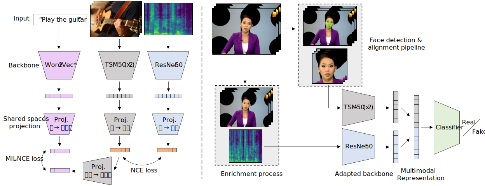

</img>

<!-- # FakeOut -->
# FakeOut: Leveraging Out-of-domain Self-supervision for Video Deepfake Detection

This is a Haiku & Jax implementation of the <i>FakeOut</i> paper.

 

</img>

 

The figure above describes the two parts of <i>FakeOut</i>. On the left is the pre-trained out-of-domain self-supervision phase, via [MMV](https://vitalab.github.io/article/2022/04/14/MultiModalVersatileNetworks.html). On the right is the adaption phase of <i>FakeOut</i> to the video deepfake detection task.

## Setup

Code coming soon...
