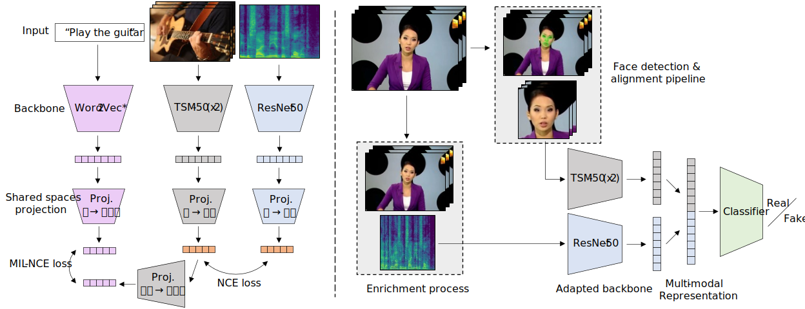

<div align="center">
</img>
</div>

<!-- # FakeOut -->
# FakeOut: Leveraging Out-of-domain Self-supervision for Multi-modal Video Deepfake Detection

This is a Haiku & Jax implementation of the <i>FakeOut</i> paper.

<p> 
</p>
<div align="center">
</img>
</div>
<p> 
</p>

The figure above describes the two parts of <i>FakeOut</i>. On the left is the pre-training out-of-domain self-supervision phase, via [MMV](https://vitalab.github.io/article/2022/04/14/MultiModalVersatileNetworks.html). On the right is the adaption phase of <i>FakeOut</i> to the video deepfake detection task.

## Setup

Code coming soon...

## BibTex
If you find <i>FakeOut</i> useful for your research, please cite the paper:
```bib
      @article{knafo2022fakeout,
        title={FakeOut: Leveraging Out-of-domain Self-supervision for Multi-modal Video Deepfake Detection},
        author = {Knafo, Gil and Fried, Ohad},
        journal={arXiv preprint arXiv:2212.00773},
        year={2022}
      }
```
